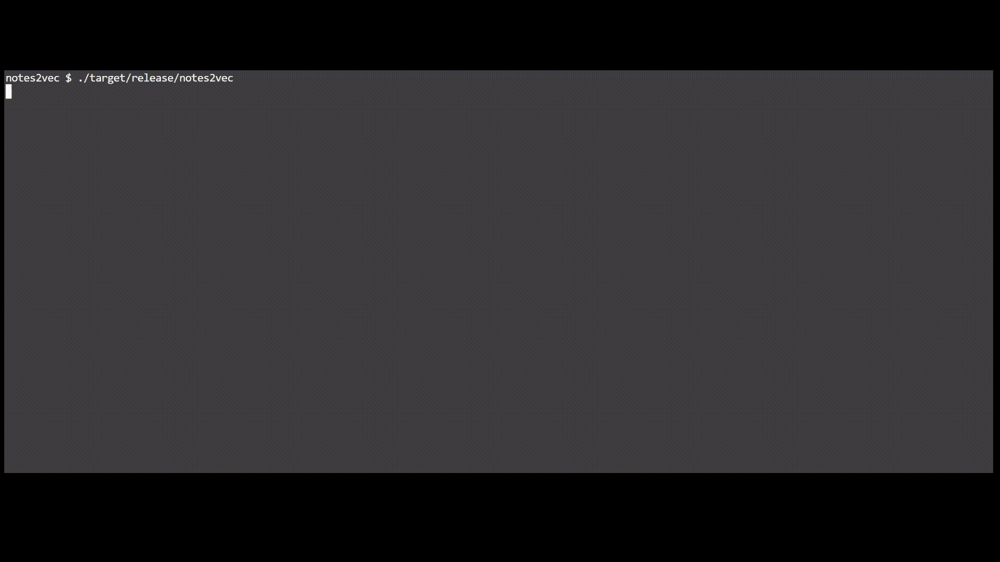

# notes2vec

A lightweight, local-first semantic search engine for personal notes, journals, and documentation.



## Overview

notes2vec helps you find your personal notes based on meaning, not just keywords. Unlike traditional search tools that require exact word matches, notes2vec understands what you're looking for even if you use different words than what you wrote.

## Features

- **Local-First**: All processing happens on your machine. No cloud, no external services.
- **Semantic Search**: Find notes by meaning, not just keywords.
- **Automatic Indexing**: Watches your note directories and updates the index automatically.
- **Privacy-Focused**: Your data never leaves your computer.
- **Zero Dependencies**: Single binary, no Rust installation needed, no Docker or external services required.

## Installation

**No Rust Required!** notes2vec is distributed as a standalone binary. You don't need to install Rust or compile anything.

Download pre-built binaries for Windows, macOS, and Linux from the [Releases page](https://github.com/AbdulmalikDS/notes2vec/releases).

**Windows:**
- Download `notes2vec-x86_64-pc-windows-msvc.zip`
- Extract and add to your PATH, or run directly

**macOS:**
- Download `notes2vec-x86_64-apple-darwin.tar.gz` (Intel) or `notes2vec-aarch64-apple-darwin.tar.gz` (Apple Silicon)
- Extract and move to `/usr/local/bin/` or add to your PATH

**Linux:**
- Download `notes2vec-x86_64-unknown-linux-gnu.tar.gz`
- Extract and move to `/usr/local/bin/` or add to your PATH

## Quick Start

### 1. Initialize

```bash
notes2vec init
```

This sets up the local database and downloads the embedding model (one-time operation, ~80MB download).

### 2. Index Your Notes

```bash
# Index all Markdown files in a directory
notes2vec index /path/to/notes

# Force re-indexing of all files (useful after updates)
notes2vec index /path/to/notes --force
```

### 3. Search

```bash
# Just run notes2vec - the TUI opens automatically!
notes2vec

# Or search from command line
notes2vec "how to configure database"
```

**Interactive TUI**: 
- Type your search query and press Enter
- Use `↑↓` arrow keys to navigate results
- Press `/` to start a new search
- Press `q` or `Esc` to quit

### 4. Watch for Changes (Daemon Mode)

```bash
notes2vec watch /path/to/notes
```

This continuously monitors your notes and automatically updates the index when files change. Press `Ctrl+C` to stop.

## Usage Examples

### Basic Workflow

```bash
# 1. Initialize (first time only)
notes2vec init

# 2. Index your notes directory
notes2vec index ~/Documents/notes

# 3. Search - just run notes2vec!
notes2vec
```

### Advanced Usage

```bash
# Use custom base directory
notes2vec init --base-dir ~/.custom/notes2vec
notes2vec index ~/notes --base-dir ~/.custom/notes2vec

# Watch mode with custom directory
notes2vec watch ~/notes --base-dir ~/.custom/notes2vec

# Search with custom directory
notes2vec search "query" --base-dir ~/.custom/notes2vec --limit 20
```

## How It Works

1. **Indexing**: Scans your Markdown files, splits them into semantic chunks, and generates embeddings using a BERT-based model
2. **Storage**: Stores vectors in a local database (redb) for fast retrieval
3. **Search**: Uses cosine similarity to find semantically similar content
4. **Updates**: Tracks file changes using content hashing to avoid re-indexing unchanged files

## Stack

- **Language**: Rust
- **ML Framework**: Candle
- **Embedding Model**: sentence-transformers/all-MiniLM-L6-v2 (384-dimensional embeddings)
- **Vector Storage**: redb (local key-value database)
- **State Management**: redb (file change tracking)
- **TUI**: ratatui + crossterm

## Project Status

**✅ Fully Functional** - All core features are implemented and working.

### Implementation Status

✅ **Completed:**
- CLI structure and command parsing (`init`, `index`, `search`, `watch`)
- Configuration management
- File discovery (Markdown files with .gitignore support)
- Markdown parsing (frontmatter, chunks, headers)
- State management (file change tracking with redb)
- Embedding generation (BERT model via Candle)
- Model downloading/loading from HuggingFace Hub
- Vector database storage (redb-based)
- Semantic search functionality
- Watch/daemon mode (automatic re-indexing)
- Interactive TUI search interface
- Optimized search algorithms (heap-based top-K)
- Efficient file operations (prefix matching)

### Performance Optimizations

- **Search**: Uses min-heap for O(N log K) complexity instead of O(N log N)
- **File Operations**: Prefix-based filtering avoids unnecessary JSON deserialization
- **Chunking**: Intelligent text splitting targeting optimal chunk sizes (~300 chars)

## Development

### Building from Source

```bash
# Clone the repository
git clone https://github.com/AbdulmalikDS/notes2vec.git
cd notes2vec

# Build the project
cargo build --release

# The binary will be at target/release/notes2vec
```

### Testing

```bash
# Run all tests
cargo test

# Run specific test suites
cargo test --test functionality_test
cargo test --test integration_test

# Quick manual test
cargo run -- init --base-dir ~/.notes2vec/test_data
cargo run -- index ./test_notes --base-dir ~/.notes2vec/test_data
cargo run -- search "your query" --base-dir ~/.notes2vec/test_data --interactive
```

### Project Structure

```
notes2vec/
├── src/
│   ├── core/          # Configuration and error handling
│   ├── indexing/      # File discovery and Markdown parsing
│   ├── search/        # Embedding model and ML operations
│   ├── storage/       # Vector and state storage (redb)
│   └── ui/            # CLI and TUI interfaces
├── tests/             # Integration and functionality tests
└── test_notes/        # Sample Markdown files for testing
```

## License

Licensed under the MIT license 

